# humanizer-ru
Verifiable chat-paste hygiene for Russian text



[](LICENSE)
[](https://pypi.org/project/humanizer-ru/)
[](https://github.com/Vladimir-Human/humanizer-ru/actions/workflows/regex-check.yml?query=branch%3Amain)

## Who needs it

- Editors and teachers: check text before publishing: `humanizer-markers --scan file.md`.
- Developers and CI: a gate against chat-interface paste: [action and contract](contract.v1.json).
- AI-assistant users: the same check inside agent environments: [MCP in one config block](#mcp-in-one-config) or the [demo](https://vladimir-human.github.io/humanizer-ru/).

## Try it in 30 seconds

- [Browser demo](https://vladimir-human.github.io/humanizer-ru/): nothing to install, your text never leaves the browser.
- In a terminal:

```text
pip install humanizer-ru
humanizer-markers --scan primer.txt
  primer.txt:1 [contentReference] Согласно отчёту :contentReference[oaicite:3]{index=3}, рост заявок за неделю 12%: https://
  primer.txt:1 [utm_chatgpt] Согласно отчёту :contentReference[oaicite:3]{index=3}, рост заявок за неделю 12%: https://
  primer.txt:2 [zero_width] Данные подтверждены ассистентом​, подробности в чате.
```

### MCP in one config

```json
{
  "mcpServers": {
    "humanizer-ru": { "command": "humanizer-mcp" }
  }
}
```

## What it does NOT do

- Rewritten text: paraphrasing hits the theoretical detection ceiling and zeroes out detectors.
- Natively smooth machine text without artifacts: population-level detection only, no per-document verdict.
- Short text: fewer signals than words; watermarks and statistics need length.
- Watermarks without the key: a distortion-free mark is undetectable to a third party by construction.

- [bib:…] keys are defined in [research/BIBLIOGRAPHY.md](research/BIBLIOGRAPHY.md).
- do not run on Markdown or markup: polish strips ##, **, guillemets, dashes; for markup use --preserve-markup.


## Why you can trust it

- [Methodology and benchmark: numbers with confidence intervals](research/F8-UMBRELLA-2026.md).
- [Public benchmark: table with CIs, reproduction commands and a where-we-are-worse column](demo/benchmark/index.html).
- [Threat model and detector boundaries](docs/THREAT-MODEL.md).
- [Python-JS parity gate for the rules](.github/workflows/regex-check.yml).
- [Self-audit: numbers, statuses, errata](eval/facts/self-audit.v1.json).

## Installing the skill in browser clients

- The demo needs no install: https://vladimir-human.github.io/humanizer-ru/ — your text never leaves the browser.
- Claude.ai and Claude Code: add the skill from `dsh/skills/humanizer-ru` following the install steps in [docs/USAGE.en.md](docs/USAGE.en.md#install-in-30-seconds).
- Agent clients supporting agentskills.io (opencode, DeepSeek Harness): unpack the text bundle from the release archive.
- A browser extension was declined: a new surface (permissions, store review) does not pay off; idea queue — [research/BACKLOG.md](research/BACKLOG.md).

## Same-name projects

GitHub hosts skills with the same name and different content. Snapshot 2026-09-05
(check: `gh repo view <owner>/humanizer-ru --json stargazerCount`):

- [ilyautov/humanizer-ru](https://github.com/ilyautov/humanizer-ru) — 284 stars: positioned as "removes neural-network signs", no public numbers registry.
- [smixs/humanizer-ru](https://github.com/smixs/humanizer-ru) — 148 stars: a deterministic linter; the only same-name project included in [LEADERBOARD.md](LEADERBOARD.md) as a candidate (paired run 2026-09-03).
- This project — verifiable chat-paste hygiene: every number comes from deterministic snapshots and the [facts registry](eval/facts/facts.v1.json), boundaries in the [THREAT-MODEL](docs/THREAT-MODEL.md), false positives in the [benchmark](demo/benchmark/index.html).

Arrived by name — choose by the verification method, not by stars.

## Project in numbers

- 58 patterns of machine writing and 40 regex markers (classes A and B).
- Proof records: 38 of 40 markers (registry research/fixtures/marker-sources.json).
- Gates: 143 gates in the full check_all (132 in --quick); fixtures live in tests/fixtures/, docs are checked by check_docs.py, persona in PERSONA.md.

## More

- [What to feed it and how rewriting works](docs/USAGE.en.md#what-to-give-it)
- [Manual install and usage](docs/USAGE.en.md#usage)
- [Architecture and patterns](docs/USAGE.en.md#architecture)
- [Security and version differences](docs/USAGE.en.md#security)
- [Sources](docs/USAGE.en.md#sources)

## Regex markers: classes A and B

Class A — hard copy-paste artifacts: service links and citation marks of
chat interfaces. Class B — contextual indicators: invisible characters,
hidden layout, placeholder fields; a single B match is not enough. Marker
class is `copypaste_artifacts`; retirement is possible only on failure in
its own class; statuses and dates — in `markers.v1.json`.


## Changelog

Full history: [CHANGELOG.md](CHANGELOG.md) and
[GitHub Releases](https://github.com/Vladimir-Human/humanizer-ru/releases).


## License

MIT

## Project status

Dogfooding means the project checks its own texts with its own rules: the style-marker threshold for shipped files is enforced by `scripts/check_own_style.py` (its run prints the current maximum).

[](https://github.com/Vladimir-Human/humanizer-ru/releases)
[](https://www.skills.sh/vladimir-human/humanizer-ru/humanizer-ru)
[](https://github.com/Vladimir-Human/humanizer-ru/blob/main/eval/facts/self-audit.v1.json)
